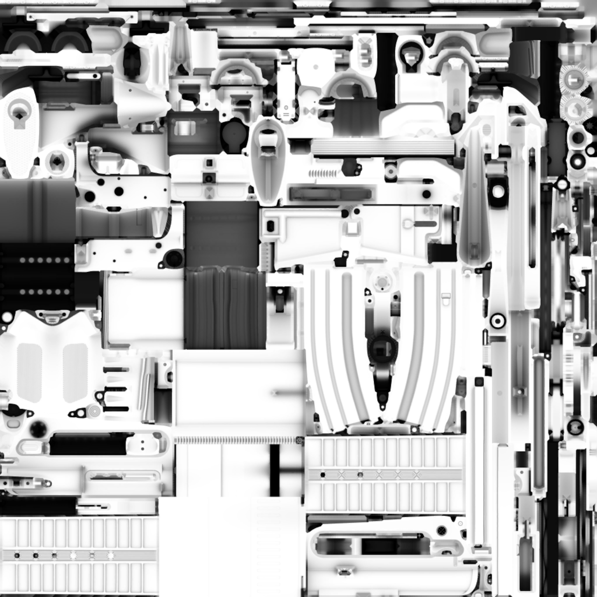
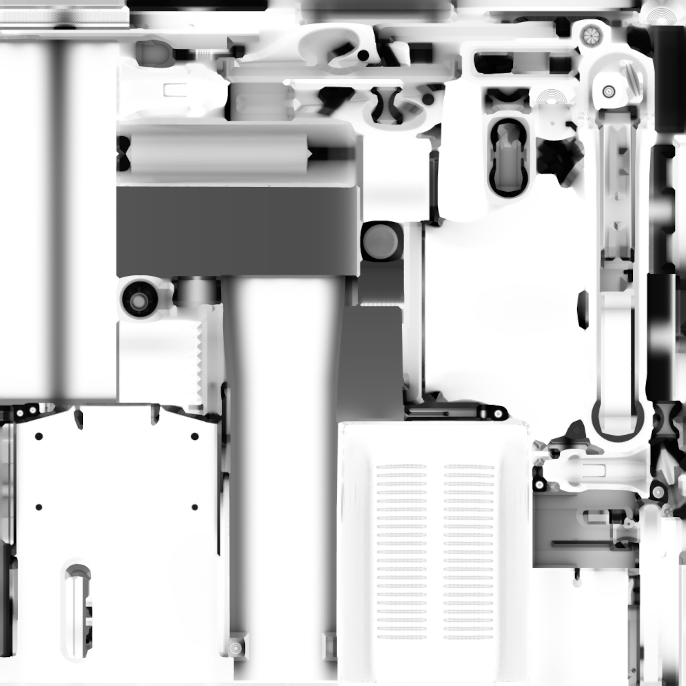

# Arquivos

Arquivos disponibilizados para ajudar a nossa comunidade na criação das skins

📄 [Visualizar ou baixar o PDF](https://github.com/skinzeras-brasil/files/raw/main/manual-cores-workshopsteam.pdf)

## Arquivos padrão das skins

Albedo (Cor)

| Armas |         |        |           |                   |
|-------|:-------:|:------:|:---------:|:-----------------:|
|       | Albedo  | Normal | Roughness | Ambient Occlusion |
| AK-47 |||||
| AUG|||||
| AWP|||||
| Dual Beretta|||||
| BB Bizon|||||
| CZ 75|||||
| Desert Eagle|||||
| Famas|||||
| Fiveseven|||||
| G3SG|||||
| Galilar|||||
| Glock|||||
| M249|||||
| M4A1-S|||||
| M4A4|||||
| MAC10|||||
| MAG7|||||
| MP5|||||
| MP7|||||
| MP9|||||
| Negev|||||
| Nova|||||
| P2000|||||
| P250|||||
| P90|||||
| Revolver R8|||||
| Sawedoff|||||
| SCAR-20|||||
| SG556|||||
| SSG08|||||
| Taser|||||
| TEC-9|||||
| UMP-45|||||
| USP-S|||||
| XM1014|||||

Os arquivos foram disponibilizados e baixados do YouTube [Viper](https://www.youtube.com/@viperskins) se inscreva no canal dele.
